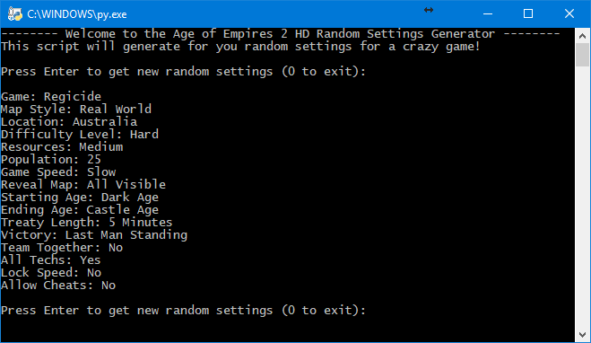

# AOE2HDRSG
**Age of Empires 2 HD - Random Settings Generator**

Welcome to the Age of Empires 2 HD - Random Settings Generator (or AOE2HDRSG for short :D).

This Python script will allow you to randomly generate settings for (what will most probably be) a crazy AOE2 game!

The script supports **all languages** in which Age of Empires 2 HD has been localized (English, Brazilian Portuguese, German, Spanish, French, Italian, Japanese, Korean, Dutch, Russian and Simplified Chinese). It currently automatically selects the language based on you operating system's language (it will soon be possible to manually select a language). If your OS language is not supported, English will be used. If you are using Windows with Japanese, Chinese or Korean, be sure to have configured the command prompt to support the correct visualization of East Asian languages.



**Note:** currently there is no option to exclude expansions maps/settings from the generator. Support will probably be added in the hopefully-not-so-distant future.

## Requirements
The requirements are:
- Python 3.x (tested with Python 3.6, but it should work with any Python 3 version)
- Nothing else :)

## Usage
```bash
python AOE2HD_RSG.py
```
Then you can press Enter as many times as you want to reroll the settings. Type 0 and then Enter to exit the program. As simple as that.

## Additional notes
The code includes the conversion from the AOE2 HD localization text files to the stripped down pkl file available here. The code only preserves strings that are actually used by the tool. If you want to change the code adding more strings, you have to copy the txt files `<AOE2 HD folder>/resources/<language>/strings/key-value/key-value-strings-utf8.txt` in the `/res` folder and rename each of them to `<language>.txt`. You have to organize the folder like this:
- /res
  - br.txt
  - de.txt
  - en.txt
  - ...

Then you must delete the old `res/strings.pkl` file and run the script as usual. The tool will automatically generate the new pkl file.

## License
Until I choose a proper license, you can basically use this code non-commercially wherever you want citing the original source (i.e. this repository). Contact me before any usage, just because I want to know if this script was useful to anyone :D
